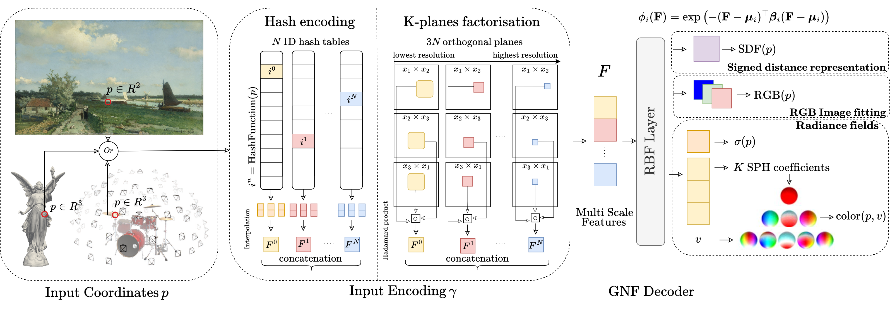

<p align="center">
  
</p>

# GNF: Gaussian Neural Fields

This is the official implementation of **GNF (Gaussian Neural Fields)**, featuring our novel RBF-based decoder for neural field modeling. The codebase supports various encoding methods and is designed for flexible, efficient neural field representation.

## Main Contribution: RBF Decoder
Our key contribution is a novel Radial Basis Function (RBF) decoder that offers:
- Improved approximation quality through adaptive basis functions
- Compact representation with efficient parameter usage
- Fast training and inference
- Multiple basis function options (Gaussian, Multiquadric, Inverse Multiquadric, etc.)

## Features
- Flexible encoding system supporting:
  - DiF-Grid
  - HashGrid
  - K-Planes
  - Hybrid K-Planes (K-Planes factorization with hash-based feature storage)
- Configurable decoders:
  - RBF (our main contribution)
  - MLP (baseline)
- Clean, minimal codebase for research and development

## Getting Started
- Configuration files:
  - RGB training: `configs/rgb.yaml`
  - SDF training: `configs/sdf.yaml`
  - NeRF training: `configs/nerf.yaml`
- Main training scripts:
  - RGB training: `main_rgb.py`
  - SDF training: `main_sdf.py`
  - NeRF training: `train_per_scene.py`

## Usage
```bash
# RGB Training
python main_rgb.py <image_file> --encoder <encoder_type> --decoder rbf

# SDF Training
python main_sdf.py <mesh_file> --encoder <encoder_type> --decoder rbf

# NeRF Training
python train_per_scene.py configs/nerf.yaml defaults.expname=<scene_name> dataset.datadir=<dataset_path>
```

## Installation

#### Tested on Windows 11 and Ubuntu 20.04 with PyTorch 1.13.0 

Install environment:
```sh
conda create -n gnf python=3.9
conda activate gnf
pip install -r requirements.txt 
```

## Windows notes for the CUDA HashGrid encoder (optional)

### Windows: CUDA HashGrid encoder

```powershell
pip install .\gridencoder
```

If the wheel has to be compiled, just make sure your Visual Studio Build Tools use **the same CUDA version that was used to compile your PyTorch wheel** (see `torch.version.cuda`).  Then:

```powershell
cd gridencoder
pip install .
```

## Citation
If you use this codebase, please cite our work.

```
@article{bouzidi2025GNF,
  title={GNF: Gaussian Neural Fields for Multidimensional Signal Representation and Reconstruction},
  author={Bouzidi, Abdelaziz and Laga, Hamid, Wannous, Hazem and Sohel Ferdous},
  journal={arXiv preprint arXiv:2503.06762},
  year={2025}
}
```

## Acknowledgements

This implementation re-uses ideas and portions of code from the following open-source projects:

* [autonomousvision/factor-fields](https://github.com/autonomousvision/factor-fields) – the original `FactorFields.py` implementation for radiance fields.
* [ashawkey/torch-ngp](https://github.com/ashawkey/torch-ngp) – hash-grid CUDA encoder and training utilities.

We thank the authors for releasing their code under permissive licences, which made this work possible.
